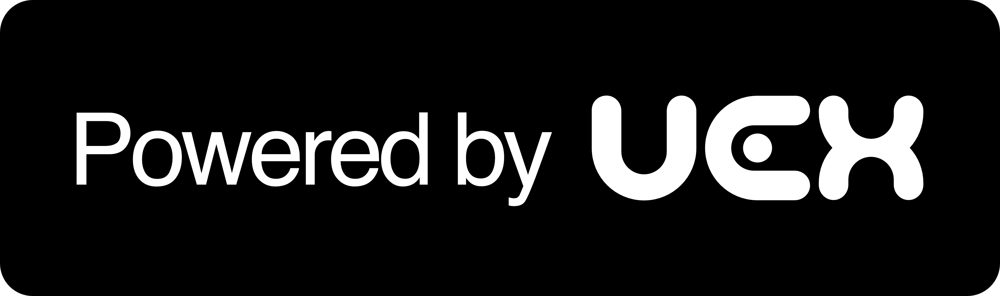

# Star Citizen MCP (SCMCP)



A Model Context Protocol (MCP) server providing real-time access to Star Citizen market data, trade routes, and wiki information. This MCP is designed to enable AI assistants like Claude and Gemini to seamlessly retrieve the latest Star Citizen trading data and lore directly into your chat!

## Features
- **Commodity Prices & Averages:** Fetch current and historical pricing for commodities via UEX. Understand the economy.
- **Trade Routes:** Find profitable trade routes based on your cargo capacity and available investment. Maximize your aUEC.
- **Terminal & Location Data:** List trading terminals, outposts, and cities across systems like Stanton and Pyro.
- **Wiki Search:** Query the Star Citizen Wiki and Star Citizen Tools for ships, items, components, and lore.
- **Built-in Caching:** API responses are automatically cached in-memory for 5 minutes to significantly reduce latency and redundant network requests.

## Available Tools

### UEX Economy Tools
- `uex_get_commodities`: List all commodities in the game.
- `uex_get_commodity_prices`: Get current commodity prices (filterable by system, planet, and terminal).
- `uex_get_commodity_averages`: Get historical average prices over time.
- `uex_get_terminals`: List trading terminals (filterable by system and planet).
- `uex_get_trade_routes`: Find optimized, high-profit trade routes based on your ship's SCU and starting investment.
- `uex_get_commodity_ranking`: Rank commodities by their profitability metrics.

### Star Citizen Wiki Tools
- `scw_search`: Search the Star Citizen Wiki for any topic.
- `scw_get_vehicle`: Retrieve detailed ship and ground vehicle data, including manufacturer and stats.
- `scw_get_item`: Retrieve weapon, armor, and ship component data.

### Star Citizen Tools (starcitizen.tools)
- `sct_search`: Search Star Citizen Tools (starcitizen.tools) for any topic.
- `sct_get_article`: Get the text content of an article from Star Citizen Tools (e.g. for lore, character info, or detailed guides).

## Installation & Local Development

Create a `.env` file in the root directory and add your UEX API token:
```env
UEXTOKEN=your_uex_api_token
```

### Automated Setup

We provide a convenient installation script that will build the MCP and automatically add it to your Claude Code or Gemini CLI:
```bash
./install.sh
```

### Manual Setup

Install dependencies:
```bash
npm install
```

Run linting and formatting:
```bash
npm run lint
npm run format
```

Run tests:
```bash
npm run test
```

Start the MCP server:
```bash
npm run build
npm start
```

## Docker

A Docker image is automatically built, tested, and published to Docker Hub upon release.

```bash
docker pull voidput/scmcp
docker run -e UEXTOKEN=your_token voidput/scmcp
```

## Release & Versioning

This project uses `semantic-release` to automate versioning and changelog generation based on commit messages. Follow conventional commit standards (e.g., `feat:`, `fix:`) to trigger automated releases!
