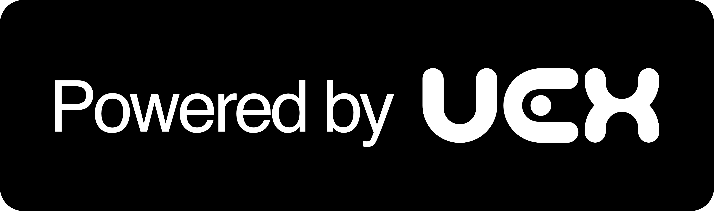

# Star Citizen MCP (SCMCP)

[](https://github.com/voidput/SCMCP/actions/workflows/docker-publish.yml)
[](https://hub.docker.com/r/voidput/scmcp)
[](https://opensource.org/licenses/ISC)

A Model Context Protocol (MCP) server providing real-time access to Star Citizen market data, trade routes, and wiki information. This MCP is designed to enable AI assistants like Claude and Gemini to seamlessly retrieve the latest Star Citizen trading data and lore directly into your chat!

## Features
- **Commodity Prices & Averages:** Fetch current and historical pricing for commodities via UEX. Understand the economy.
- **Trade Routes:** Find profitable trade routes based on your cargo capacity and available investment. Maximize your aUEC.
- **Terminal & Location Data:** List trading terminals, outposts, and cities across systems like Stanton and Pyro.
- **Wiki Search:** Query the Star Citizen Wiki and Star Citizen Tools for ships, items, components, and lore.
- **Built-in Caching:** API responses are automatically cached in-memory for 5 minutes to significantly reduce latency and redundant network requests.

## Available Tools

### UEX Economy Tools
- `uex_get_commodities`: List all commodities in the game.
- `uex_get_commodity_prices`: Get current commodity prices (filterable by system, planet, and terminal).
- `uex_get_commodity_averages`: Get historical average prices over time.
- `uex_get_terminals`: List trading terminals (filterable by system and planet).
- `uex_get_trade_routes`: Find optimized, high-profit trade routes based on your ship's SCU and starting investment.
- `uex_get_commodity_ranking`: Rank commodities by their profitability metrics.

### Star Citizen Wiki Tools
- `scw_search`: Search the Star Citizen Wiki for any topic.
- `scw_get_vehicle`: Retrieve detailed ship and ground vehicle data, including manufacturer and stats.
- `scw_get_item`: Retrieve weapon, armor, and ship component data.

### Star Citizen Tools (starcitizen.tools)
- `sct_search`: Search Star Citizen Tools (starcitizen.tools) for any topic.
- `sct_get_article`: Get the text content of an article from Star Citizen Tools (e.g. for lore, character info, or detailed guides).

## Triggering from a Stream Deck or VoiceAttack

Stream Deck and VoiceAttack can launch a process or hit a URL; neither speaks MCP, which is a stdio protocol owned by the host that spawns it. So alongside the MCP server there is a **local daemon** that puts the same tools behind plain HTTP on `127.0.0.1`.

```bash
npm run build
npm run daemon        # http://127.0.0.1:7331
```

Both entry points share one tool registry (`src/tools.ts`); `src/index.ts` is the MCP adapter and `src/http.ts` is the HTTP one.

### Endpoints

| Route | Returns | For |
|---|---|---|
| `GET /health` | JSON status | Checking the daemon is up |
| `GET /tools` | Tool names and schemas | Discovery |
| `GET /presets` | Voice preset names and params | Discovery |
| `GET /q/:tool?args` | Raw JSON | Stream Deck keys, scripts |
| `GET /say/:preset?args` | One plain-English sentence | Text-to-speech |
| `GET/POST /ask?q=...` | One sentence, via the model | Open-ended questions |

`/q/*` is a direct call — no model, no cost, and answers from the 5-minute cache in milliseconds. `/ask` runs the question through Claude with the same tools available and takes a few seconds, so use it only where a preset can't answer.

```bash
curl "http://127.0.0.1:7331/say/sell?commodity=Gold"
# Gold sells highest at Everus Harbor in Stanton, 32,500 per S C U.

curl "http://127.0.0.1:7331/say/route?scu=96&investment=1000000"
# Best route: buy Gold at HDMS-Stanhope, sell at Everus Harbor, for 450,000 profit.

curl "http://127.0.0.1:7331/q/uex_get_commodity_prices?commodity_name=Laranite"
```

Voice presets: `sell`, `buy`, `route`, `top`.

### Stream Deck

Bind a key to **System → Open**, pointing at `powershell.exe` with:

```
-ExecutionPolicy Bypass -File "C:\path\to\SCMCP\integrations\streamdeck\scmcp.ps1" -Preset sell -Arg commodity=Gold
```

The script fetches the answer and speaks it through the Windows synthesiser. Use `-Raw -NoSpeak` to print JSON instead, or `-Ask "..."` for a natural-language question. See `integrations/streamdeck/scmcp.ps1` for all options.

*Not yet built:* a proper Stream Deck plugin (`@elgato/streamdeck`) that renders the answer on the key face rather than only speaking it. The daemon already returns everything such a plugin needs from `/q/*`.

### VoiceAttack

Use the inline C# function in `integrations/voiceattack/SCMCP.cs` rather than shelling out — it avoids flashing a console window over the game. The file's header comments give the exact command layout.

For reliable recognition, prefer a **closed phrase list** over dictation. Generate one from live commodity data:

```bash
npm run voice:grammar                    # prints the list and suggested commands
npm run voice:grammar -- -o grammar.txt
```

That produces `[Gold;Laranite;Titanium;...]` for pasting into a command phrase, with the matched word exposed as `{TXT:1}`. Dictation mode still has its place — route `{DICTATION}` to `/ask` for open-ended lore and ship questions where the vocabulary isn't known ahead of time.

### Configuration

| Variable | Default | Purpose |
|---|---|---|
| `SCMCP_HTTP_PORT` | `7331` | Daemon port |
| `SCMCP_HTTP_TOKEN` | *(unset)* | Shared secret required on every request |
| `SCMCP_ASK_MODEL` | `claude-opus-5` | Model behind `/ask` |
| `SCMCP_ASK_EFFORT` | `low` | Reasoning effort for `/ask` |
| `ANTHROPIC_API_KEY` | *(unset)* | Required for `/ask`; every other route works without it |

The daemon binds to `127.0.0.1` only. It also rejects requests carrying browser headers (`Origin`, cross-site `Sec-Fetch-Site`), so a web page you happen to visit cannot quietly spend your API credit against `/ask`. Set `SCMCP_HTTP_TOKEN` if you want to gate other local processes too.

`/ask` defaults to `claude-opus-5`. If you'd rather trade some quality for latency and cost while flying, set `SCMCP_ASK_MODEL=claude-haiku-4-5` or `claude-sonnet-5`.

## Installation & Local Development

Create a `.env` file in the root directory and add your UEX API token:
```env
UEXTOKEN=your_uex_api_token
```

### Automated Setup

We provide a convenient installation script that will build the MCP and automatically add it to your Claude Code or Gemini CLI:
```bash
./install.sh
```

### Manual Setup

Install dependencies:
```bash
npm install
```

Run linting and formatting:
```bash
npm run lint
npm run format
```

Run tests:
```bash
npm run test
```

Start the MCP server:
```bash
npm run build
npm start
```

## Docker

A Docker image is automatically built, tested, and published to Docker Hub upon release.

```bash
docker pull voidput/scmcp
docker run -e UEXTOKEN=your_token voidput/scmcp
```

## Release & Versioning

This project uses `semantic-release` to automate versioning and changelog generation based on commit messages. Follow conventional commit standards (e.g., `feat:`, `fix:`) to trigger automated releases!

---
<p align="center">
  <a href="https://uexcorp.space/">
    
  </a>
</p>
